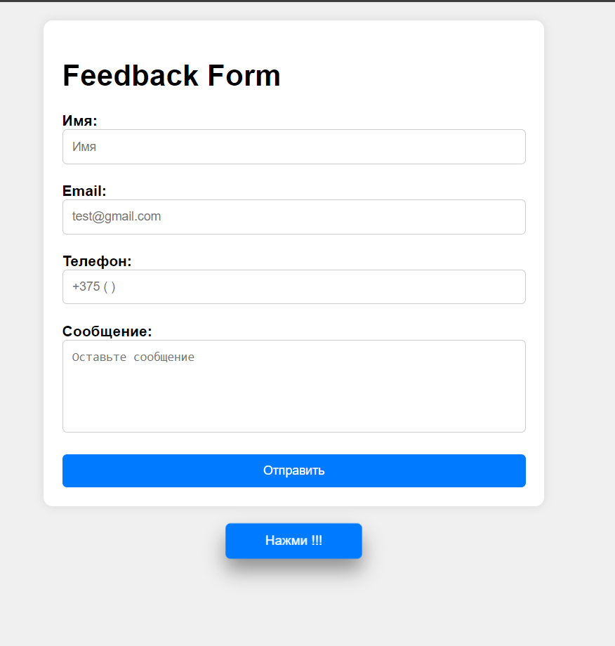
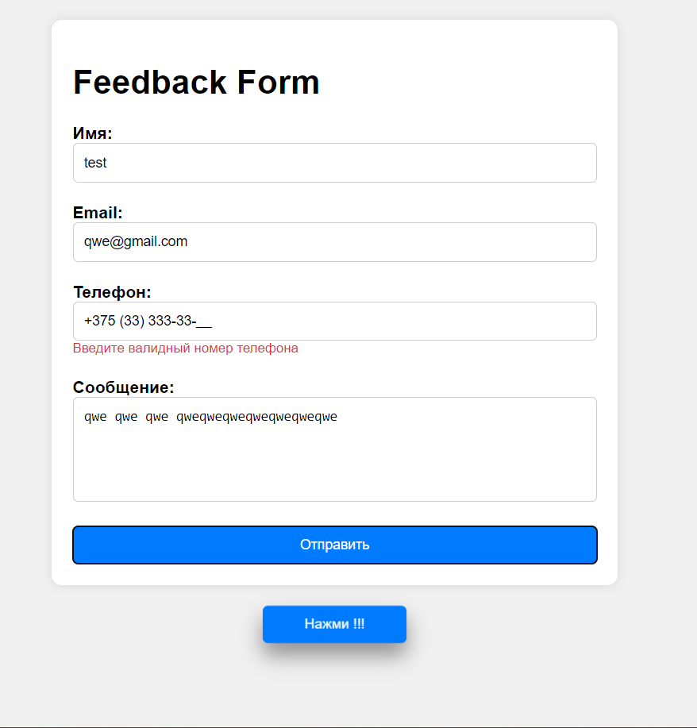
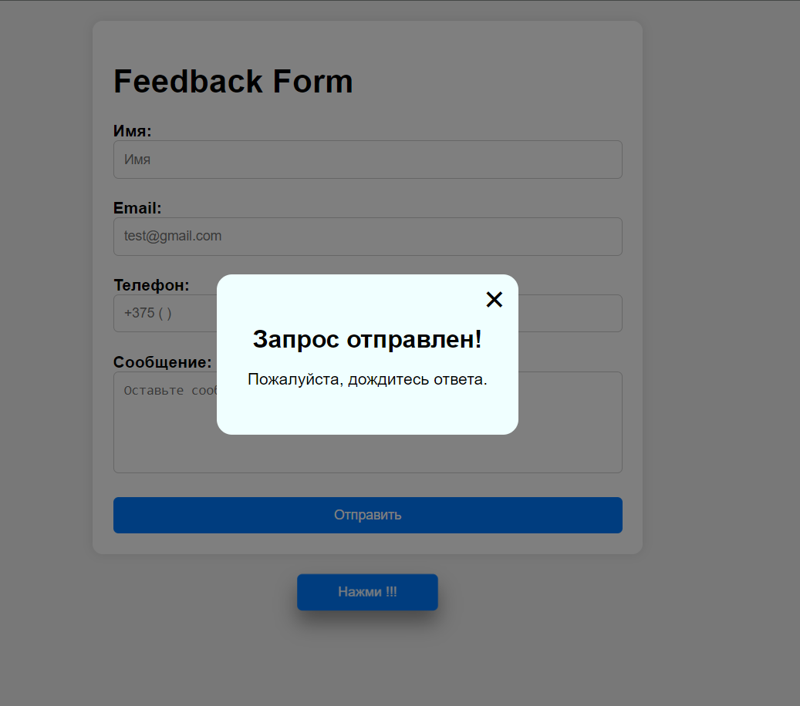

# Тестовое задание Front-end Developer

## Описание

Этот проект представляет собой реализацию отправления сообщения.

---

### Технологии:

- JavaScript
- HTML
- SCSS
- Webpack

---

## Запуск приложения

### Установите зависимости:

> `npm install`

### Запустите приложение вместе с сервером:

> `npm run server`

> `npm start`

Приложение будет доступно по адресу http://localhost:3001.

### Если у вас есть какие-либо вопросы или замечания по проекту, свяжитесь со мной:

- Email: vlad.loban.dev@gmail.com
- Telegram: https://t.me/vlad_loban

